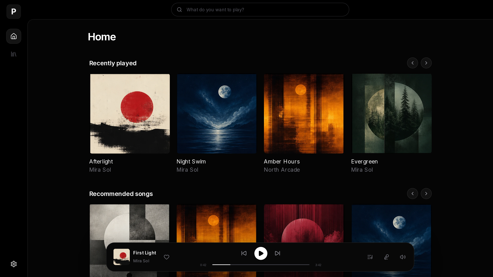

# Parson

Your music. Instantly.

Parson is a local-first music app for your own collection.

Choose a folder. Start listening.



[Download](https://parson.dev) ·
[Docs](https://parson.dev/docs) ·
[Releases](https://github.com/ParsonLabs/Parson/releases/latest)

## Start

Install Parson, create your account, and choose your music folder.

Desktop apps include everything needed to run your library.

## Download

| Platform    | Available packages                                                                                                                                                                                                        |
| ----------- | ------------------------------------------------------------------------------------------------------------------------------------------------------------------------------------------------------------------------- |
| Windows     | [x64 installer](https://github.com/ParsonLabs/Parson/releases/download/v1.0.0/Parson_1.0.0_x64-setup.exe) · [ARM64 installer](https://github.com/ParsonLabs/Parson/releases/download/v1.0.0/Parson_1.0.0_arm64-setup.exe) |
| Linux x64   | [AppImage](https://github.com/ParsonLabs/Parson/releases/download/v1.0.0/Parson_1.0.0_x86_64.AppImage) · [Debian package](https://github.com/ParsonLabs/Parson/releases/download/v1.0.0/Parson_1.0.0_amd64.deb)           |
| Linux ARM64 | [AppImage](https://github.com/ParsonLabs/Parson/releases/download/v1.0.0/Parson_1.0.0_arm64.AppImage) · [Debian package](https://github.com/ParsonLabs/Parson/releases/download/v1.0.0/Parson_1.0.0_arm64.deb)            |
| macOS       | [Intel DMG](https://github.com/ParsonLabs/Parson/releases/download/v1.0.0/Parson_1.0.0_x64.dmg) · [Apple Silicon DMG](https://github.com/ParsonLabs/Parson/releases/download/v1.0.0/Parson_1.0.0_arm64.dmg)               |
| Server      | `ghcr.io/parsonlabs/parson:1.0.0`                                                                                                                                                                                         |

Build provenance is included with the release.

## Docker

```yaml
services:
  parson:
    image: ghcr.io/parsonlabs/parson:latest
    network_mode: host
    volumes:
      - /path/to/parson-data:/Parson
      - /path/to/music:/music:ro
    restart: unless-stopped
```

Open `http://localhost:1993`, create your account, and choose `/music`.

## Privacy

Parson does not upload analytics or crash reports.

Music, accounts, playlists, history, and recommendations stay on infrastructure
you control. External requests are limited to services you use, such as lyrics,
updates, and casting.

[Privacy and security](https://parson.dev/docs/accounts-privacy-security)

## Development

Requires Bun, Rust, Node.js, FFmpeg, and the native build toolchain for your
platform.

```sh
bun install --frozen-lockfile
cargo run -p parson-music
```

Run the web app separately:

```sh
bun --filter parson-music-web dev
```

[Development guide](https://parson.dev/docs/development)

## Repository

- `crates/parson-core` — accounts, identities, and libraries
- `crates/backend` — server, indexer, storage, APIs, and discovery
- `apps/web` — web player
- `apps/desktop` — desktop packaging
- `apps/site` — website and docs

## Security

Report vulnerabilities privately through
[GitHub Security Advisories](https://github.com/ParsonLabs/Parson/security/advisories/new).

Deployment guidance is in the
[privacy and security documentation](https://parson.dev/docs/accounts-privacy-security).

## License

[GPL-3.0-only](LICENSE)
